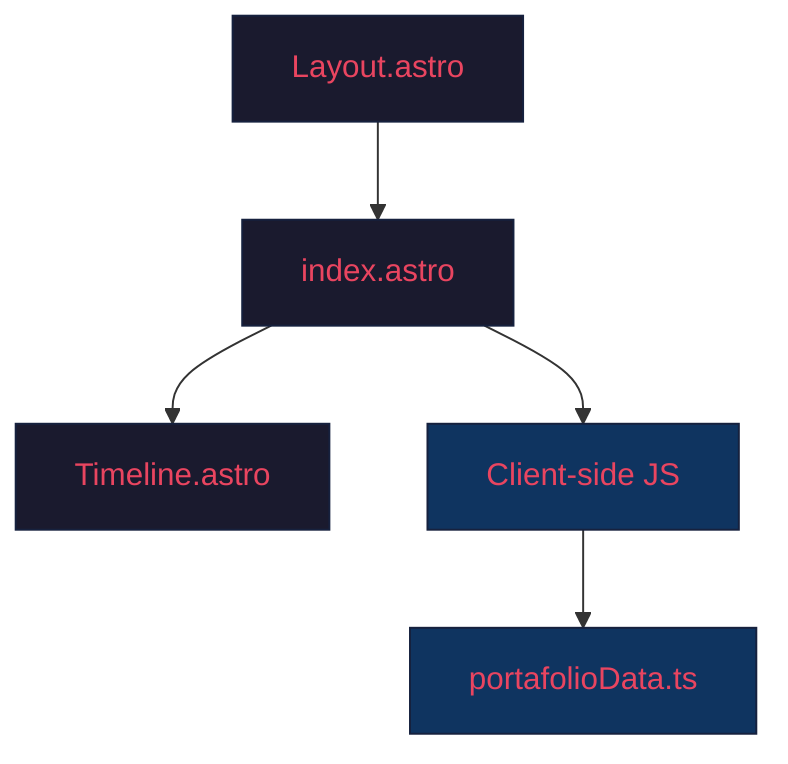

# Documento de Diseño: Mejoras del Portafolio

## Visión General

Este documento describe el diseño técnico para implementar las mejoras al portafolio web de SDET construido con Astro + Tailwind CSS, que simula la interfaz del Playwright Trace Viewer. Las mejoras cubren 7 áreas: diseño responsivo, SEO/Open Graph, accesibilidad, corrección de enlaces, sección de proyectos placeholder, limpieza de componentes no utilizados y organización de código.

El proyecto es pequeño (una sola página Astro con datos en un archivo TypeScript) y no se espera que crezca significativamente. El diseño prioriza cambios pragmáticos y directos.

## Arquitectura

La arquitectura actual se mantiene sin cambios fundamentales. El portafolio es una SPA de una sola página con:



Los cambios se aplican en capas sobre la estructura existente:

1. **Layout.astro**: Se agregan meta tags SEO/OG en el `<head>`.
2. **index.astro**: Se modifica el HTML para responsividad, ARIA roles, y el nuevo paso de proyectos. Se actualiza el JS para manejar `aria-current`, `aria-selected`, y `aria-label` dinámicos.
3. **portafolioData.ts**: Se agrega la entrada `btn-projects` y se reorganiza con comentarios de sección. Se cambian los `<button>` de GitHub/LinkedIn a `<a>` con `href` reales.
4. **Eliminación**: Se borran `Welcome.astro` y `Header.astro`.

No se introducen nuevas dependencias ni componentes.

## Componentes e Interfaces

### Layout.astro — Cambios

Se extiende la interfaz `Props` para aceptar metadatos SEO opcionales:

```typescript
interface Props {
    title: string;
    description?: string;
    ogImage?: string;
}
```

Se agregan en el `<head>`:
- `<meta name="description">` con texto descriptivo del perfil.
- Tags Open Graph: `og:title`, `og:description`, `og:type` (website), `og:url`, `og:image`.
- Tags Twitter Card: `twitter:card` (summary_large_image), `twitter:title`, `twitter:description`, `twitter:image`.

Todos los valores se definen como defaults en el componente (no dependen de JS del cliente), cumpliendo el requisito 2.4.

### index.astro — Cambios Estructurales

#### Responsividad (Requisito 1)

El layout de tres columnas (`<main class="flex flex-1 overflow-hidden">`) se convierte en una columna apilada en viewports < 1024px usando clases Tailwind:

- **Sidebar Izquierdo**: En móvil, se convierte en una barra horizontal con scroll (`overflow-x-auto`, `flex-row`, `whitespace-nowrap`). Los botones de acción se muestran como pestañas horizontales desplazables.
- **Área de Contenido**: Ocupa el ancho completo.
- **Sidebar Derecho**: Se muestra debajo del contenido como un panel colapsable con un botón toggle.

Clases clave:
```
<main class="flex flex-col lg:flex-row flex-1 overflow-hidden">
  <aside class="lg:w-80 ...">  <!-- sidebar izquierdo -->
  <section class="flex-1 ..."> <!-- contenido -->
  <aside class="lg:w-[450px] ..."> <!-- sidebar derecho -->
</main>
```

El `overflow-hidden` del body se ajusta para permitir scroll vertical en móvil.

#### Accesibilidad (Requisito 3)

- Sidebar Izquierdo: `role="navigation"` + `aria-label="Pasos de la prueba"`.
- Botón activo: `aria-current="step"` (gestionado por JS al hacer click).
- Área de Contenido: `aria-live="polite"` + `aria-label` dinámico que describe la sección visible.
- Sidebar Derecho tabs: `role="tablist"` en el contenedor, `role="tab"` + `aria-selected` en cada pestaña, `role="tabpanel"` en el panel de contenido.
- Contraste: Reemplazar `text-zinc-600` por `text-zinc-400` en textos sobre fondos oscuros donde el ratio sea < 4.5:1.

#### Nuevo Paso de Proyectos (Requisito 5)

Se agrega un botón `btn-projects` entre `btn-edu` y `btn-contact` en el sidebar izquierdo:

```html
<button id="btn-projects" class="action-btn">
    <span class="time-label">2.9s</span>
    <span class="text-[#45ad62]">click</span>
    <span class="text-zinc-400 font-semibold"> locator('#projects') </span>
</button>
```

### portafolioData.ts — Cambios

#### Nueva entrada `btn-projects`

Se agrega entre `btn-edu` y `btn-contact` con las mismas propiedades (`dom`, `call`, `console`, `network`, `source`). El `dom` muestra un mensaje placeholder indicando que los proyectos se agregarán próximamente.

#### Corrección de enlaces GitHub/LinkedIn (Requisito 4)

En la entrada `btn-contact`, los elementos `<button>` de GitHub y LinkedIn se reemplazan por `<a>`:

```html
<a href="https://github.com/[usuario]" target="_blank" rel="noopener noreferrer"
   data-pw-selector="getByRole('link', { name: 'GitHub' })"
   class="flex-1 py-2 bg-zinc-800 hover:bg-zinc-700 text-white text-xs font-bold rounded transition-colors border border-zinc-600 flex justify-center items-center gap-2">
    GitHub
</a>
```

Se mantiene el estilo visual idéntico al actual (solo cambia la semántica del elemento).

#### Reorganización (Requisito 7)

Se agregan comentarios de sección para separar `getSourceCode` de los datos de contenido:

```typescript
// ============================================
// Utilidades de renderizado
// ============================================
function getSourceCode(...) { ... }

// ============================================
// Datos del portafolio
// ============================================
export const portfolioData = { ... };
```

La interfaz de exportación (`portfolioData`) no cambia.

### Archivos a Eliminar (Requisito 6)

- `src/components/Welcome.astro` — No importado por ningún archivo.
- `src/components/Header.astro` — No importado por ningún archivo (el header está inline en `index.astro`).

Se verifica que no existan imports ni referencias a estos archivos antes de eliminar.

## Modelos de Datos

No se introducen nuevos modelos de datos. La estructura existente de `portfolioData` se mantiene:

```typescript
type PortfolioEntry = {
    dom: string;      // HTML del contenido principal
    call: string;     // HTML del tab "Call"
    console: string;  // HTML del tab "Console"
    network: string;  // HTML del tab "Network"
    source: string;   // HTML del tab "Source"
};

type PortfolioData = Record<string, PortfolioEntry>;
```

Se agrega una nueva key `'btn-projects'` al objeto `portfolioData` con la misma estructura.

La interfaz `Props` de `Layout.astro` se extiende con campos opcionales `description` y `ogImage`, ambos con valores por defecto.


## Propiedades de Correctitud

*Una propiedad es una característica o comportamiento que debe mantenerse verdadero en todas las ejecuciones válidas de un sistema — esencialmente, una declaración formal sobre lo que el sistema debe hacer. Las propiedades sirven como puente entre especificaciones legibles por humanos y garantías de correctitud verificables por máquina.*

### Propiedad 1: Exclusividad de aria-current en pasos

*Para cualquier* conjunto de botones de acción y cualquier botón seleccionado, después de activar ese botón, exactamente ese botón debe tener `aria-current="step"` y ningún otro botón debe tener ese atributo.

**Valida: Requisito 3.2**

### Propiedad 2: aria-label del contenido refleja la sección activa

*Para cualquier* botón de acción activado, el atributo `aria-label` del Área de Contenido debe actualizarse a un valor que describa la sección correspondiente a ese botón (e.g., "Introducción", "Experiencia", "Habilidades", "Educación", "Proyectos", "Contacto").

**Valida: Requisito 3.4**

### Propiedad 3: Exclusividad de aria-selected en pestañas

*Para cualquier* pestaña del Sidebar Derecho seleccionada, exactamente esa pestaña debe tener `aria-selected="true"` y todas las demás pestañas deben tener `aria-selected="false"`.

**Valida: Requisito 3.6**

### Propiedad 4: Completitud de entradas en portfolioData

*Para cualquier* entrada en el objeto `portfolioData`, dicha entrada debe contener exactamente las 5 propiedades requeridas: `dom`, `call`, `console`, `network` y `source`, y cada una debe ser un string no vacío.

**Valida: Requisitos 5.4, 7.2**

## Manejo de Errores

Dado que este es un portafolio estático sin backend ni formularios, el manejo de errores es mínimo:

1. **Datos faltantes en portfolioData**: Si un botón de acción no tiene entrada correspondiente en `portfolioData`, el JS existente ya verifica `if(contentArea && dataEntry)` antes de actualizar. No se requiere cambio.

2. **Enlaces externos rotos**: Los enlaces de GitHub y LinkedIn apuntan a URLs externas. Si el perfil no existe, el navegador mostrará el error 404 del sitio destino. No se maneja en el portafolio.

3. **Viewport extremo (< 320px)**: El diseño responsivo usa `min-width` implícito de Tailwind. En viewports menores a 320px, el contenido puede desbordar pero seguirá siendo funcional con scroll horizontal.

4. **JavaScript deshabilitado**: Las meta tags SEO/OG se renderizan en el servidor (Astro SSG), por lo que funcionan sin JS. La navegación entre secciones requiere JS — sin él, el usuario ve la sección inicial (intro) estáticamente.

## Estrategia de Testing

### Enfoque Dual

Se utilizan tanto tests unitarios como tests basados en propiedades para cobertura completa:

- **Tests unitarios**: Verifican ejemplos específicos, casos edge y condiciones de error.
- **Tests de propiedades**: Verifican propiedades universales a través de múltiples inputs generados.

Ambos son complementarios y necesarios.

### Tests Unitarios

Los tests unitarios cubren los ejemplos identificados en el análisis de criterios:

1. **Meta tags SEO/OG** (Requisitos 2.1-2.3): Verificar que el HTML construido contiene `meta[name="description"]`, las 5 tags OG y las 4 tags Twitter Card.
2. **ARIA estático** (Requisitos 3.1, 3.3, 3.7): Verificar que el sidebar tiene `role="navigation"`, el área de contenido tiene `aria-live="polite"`, y las tabs implementan el patrón ARIA correcto.
3. **Enlaces GitHub/LinkedIn** (Requisitos 4.1-4.4): Verificar que son `<a>` con `href`, `target="_blank"` y `rel="noopener noreferrer"`.
4. **Paso de proyectos** (Requisitos 5.1-5.2): Verificar que existe el botón y que el DOM contiene un mensaje placeholder.
5. **Eliminación de archivos** (Requisitos 6.1-6.3): Verificar que `Welcome.astro` y `Header.astro` no existen y que el build compila sin errores.

### Tests Basados en Propiedades

Se utiliza **fast-check** como librería de property-based testing para TypeScript/JavaScript.

Cada test de propiedad debe:
- Ejecutar un mínimo de **100 iteraciones**.
- Referenciar la propiedad del documento de diseño con un comentario tag.
- Formato del tag: **Feature: portfolio-improvements, Property {número}: {texto de la propiedad}**

Propiedades a implementar:

1. **Feature: portfolio-improvements, Property 1: Exclusividad de aria-current en pasos** — Generar secuencias aleatorias de clicks en botones de acción y verificar que solo el último clickeado tiene `aria-current="step"`.

2. **Feature: portfolio-improvements, Property 2: aria-label del contenido refleja la sección activa** — Para cualquier botón de acción seleccionado aleatoriamente, verificar que el `aria-label` del área de contenido corresponde a la sección correcta.

3. **Feature: portfolio-improvements, Property 3: Exclusividad de aria-selected en pestañas** — Generar secuencias aleatorias de clicks en pestañas y verificar que exactamente una tiene `aria-selected="true"`.

4. **Feature: portfolio-improvements, Property 4: Completitud de entradas en portfolioData** — Para cualquier key generada del conjunto de keys de `portfolioData`, verificar que la entrada tiene las 5 propiedades requeridas como strings no vacíos.

Cada propiedad de correctitud se implementa con un **único** test basado en propiedades.
