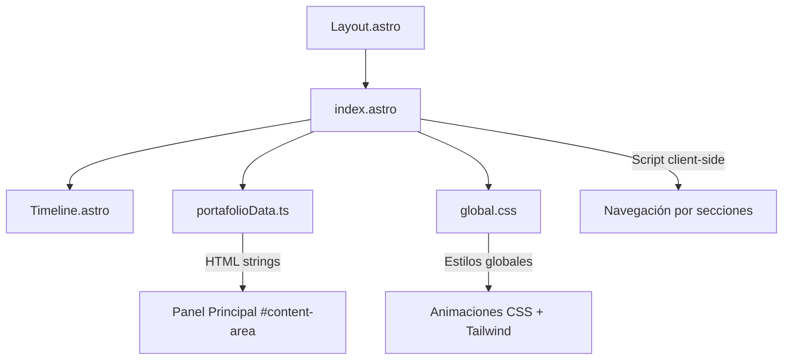

# Documento de Diseño — Mejoras Visuales del Portafolio

## Resumen

Este documento describe el diseño técnico para implementar las mejoras visuales del portafolio SDET que simula el Playwright Trace Viewer. Las mejoras cubren 7 áreas: reescritura de textos de perfil, corrección de idioma, enriquecimiento de paleta de colores, animaciones de entrada, micro-interacciones, iconos SVG profesionales y mejoras en la sección de Skills. Todas las modificaciones se realizan sobre la arquitectura existente de Astro + Tailwind CSS sin agregar dependencias externas de animación ni iconos.

## Arquitectura

El portafolio es una SPA de una sola página construida con Astro. La arquitectura actual se mantiene intacta:



**Decisión de diseño**: No se agregan dependencias externas. Las animaciones se implementan con CSS puro (`@keyframes` + clases de utilidad Tailwind). Los iconos SVG se embeben inline directamente en los strings HTML de `portafolioData.ts`. Esto mantiene el bundle mínimo y evita problemas de carga.

**Flujo de datos**: Los datos del portafolio viven en `portafolioData.ts` como strings HTML. El script en `index.astro` inyecta estos strings en `#content-area` al hacer clic en los botones de acción. Las animaciones de entrada se aplican vía clases CSS que se agregan/remueven durante la transición.

## Componentes e Interfaces

### Archivos modificados

| Archivo | Cambios |
|---|---|
| `src/data/portafolioData.ts` | Reescritura de bio, corrección de idioma, iconos SVG inline, reorganización de skills con categorías |
| `src/styles/global.css` | Animaciones `@keyframes`, clases de micro-interacción, estilos de focus accesible, `prefers-reduced-motion` |
| `src/pages/index.astro` | Lógica de animación staggered al cambiar sección, aplicación de clases de entrada |
| `src/layouts/Layout.astro` | Cambio de `lang="es"` a `lang="en"`, actualización de meta description a inglés |
| `tailwind.config.mjs` | Extensión de colores de acento personalizados |

### Interfaz de animación (CSS)

```css
/* Clases que se aplican dinámicamente */
.animate-fade-in-up    /* Entrada: opacity 0→1 + translateY 12px→0 */
.stagger-child         /* Delay incremental para hijos */
.skill-badge-hover     /* Efecto hover en badges */
.card-hover            /* Efecto hover en tarjetas */
.focus-ring            /* Indicador de focus accesible */
```

### Interfaz de datos (portafolioData.ts)

La estructura `portfolioData` no cambia su interfaz. Cada entrada sigue teniendo `{ dom, call, console, network, source }`. Solo cambia el contenido HTML de `dom` en las secciones afectadas.

## Modelos de Datos

### Paleta de colores extendida

Se agregan 2 colores de acento al tema de Tailwind:

| Token | Valor | Uso |
|---|---|---|
| `accent-purple` | `#a78bfa` (violet-400) | Categoría de lenguajes de programación en Skills |
| `accent-amber` | `#fbbf24` (amber-400) | Categoría de herramientas/otros en Skills |
| `blue-500` (existente) | `#3b82f6` | Acento principal, enlaces, rol |
| `green` (existente) | `#45ad62` | Frameworks de testing (Playwright, Cypress, Selenium) |

### Estructura de Skills reorganizada

```
Skills
├── Testing Frameworks (verde, badges prominentes, tamaño mayor)
│   ├── PLAYWRIGHT
│   ├── CYPRESS
│   └── SELENIUM
├── Programming Languages (púrpura)
│   ├── JAVA
│   ├── JAVASCRIPT
│   ├── TYPESCRIPT
│   └── PYTHON
└── Tools & Practices (ámbar)
    ├── API TESTING
    ├── GIT
    ├── JIRA
    ├── K6
    ├── CI/CD PIPELINES
    ├── SQL QUERIES
    └── MANTISBT
```

### Iconos SVG

Se utilizan SVGs inline de 20x20px con `currentColor` para heredar el color del contexto:

| Icono | Uso | Fuente |
|---|---|---|
| GitHub (Octocat) | Enlace GitHub en contacto | Path SVG estándar de Simple Icons |
| LinkedIn | Enlace LinkedIn en contacto | Path SVG estándar de Simple Icons |
| MapPin | Reemplaza emoji 📍 | Heroicons outline |
| Phone | Reemplaza emoji 📱 | Heroicons outline |
| Envelope | Reemplaza emoji ✉️ | Heroicons outline |

### Textos de bio reescritos (inglés)

La bio se reestructura en 3 párrafos:
1. **Identidad profesional**: Quién es y qué lo motiva (pasión por la calidad)
2. **Stack técnico**: Herramientas principales (Playwright, Cypress, Selenium, K6, CI/CD)
3. **Valor diferenciador**: Qué aporta de único (enfoque en automatización end-to-end)

El subtítulo de rol cambia de `> QA ENGINEER` a `> SDET · QA Automation Engineer`.

### Animaciones

| Animación | Duración | Easing | Trigger |
|---|---|---|---|
| fade-in-up (entrada de sección) | 300ms | ease-out | Clic en Botón_Acción |
| stagger (hijos) | 300ms + delay incremental 60ms | ease-out | Carga de contenido |
| badge hover (scale + shadow) | 150ms | ease | Mouse hover |
| card hover (border glow) | 200ms | ease | Mouse hover |
| button active transition | 200ms | ease | Clic en Botón_Acción |
| focus ring | instantáneo | - | Focus por teclado |


## Propiedades de Correctitud

*Una propiedad es una característica o comportamiento que debe mantenerse verdadero en todas las ejecuciones válidas de un sistema — esencialmente, una declaración formal sobre lo que el sistema debe hacer. Las propiedades sirven como puente entre especificaciones legibles por humanos y garantías de correctitud verificables por máquina.*

### Propiedad 1: Consistencia de idioma inglés en todas las secciones

*Para cualquier* sección en `portfolioData`, el contenido DOM visible no debe contener frases conocidas en español (como "Proyectos destacados próximamente", "Esta sección se actualizará", "Pasos de la prueba", etc.). Todo el texto orientado al usuario debe estar en inglés.

**Valida: Requisitos 2.1, 2.2, 1.4**

### Propiedad 2: Respeto a prefers-reduced-motion

*Para cualquier* clase de animación definida en el stylesheet (fade-in-up, stagger, badge hover scale, card hover glow), debe existir una regla `@media (prefers-reduced-motion: reduce)` que desactive o reduzca la animación a `none` o duración `0s`.

**Valida: Requisito 4.4**

### Propiedad 3: Indicadores de focus accesibles y distintos de hover

*Para cualquier* elemento interactivo (botones de acción, badges de skills, enlaces de contacto), el estilo `focus-visible` debe estar definido y ser visualmente distinto del estilo `hover`, proporcionando un indicador de focus accesible.

**Valida: Requisito 5.4**

### Propiedad 4: Iconos de contacto son SVGs profesionales inline

*Para cualquier* ítem de contacto en la Sección_Contacto, el DOM debe contener un elemento `<svg>` inline con `currentColor` y dimensiones entre 16-20px, y no debe contener caracteres emoji (📍, 📱, ✉️).

**Valida: Requisitos 6.3, 6.4**

### Propiedad 5: Etiquetas de categoría en cada grupo de Skills

*Para cualquier* grupo de categoría en la Sección_Skills (Testing Frameworks, Programming Languages, Tools & Practices), debe existir un elemento de etiqueta de categoría visible que preceda a los badges del grupo.

**Valida: Requisito 7.3**

## Manejo de Errores

| Escenario | Estrategia |
|---|---|
| Navegador no soporta CSS animations | Las animaciones usan progressive enhancement; el contenido se muestra sin animación |
| `prefers-reduced-motion: reduce` activo | Media query desactiva todas las animaciones; el contenido aparece instantáneamente |
| SVG no renderiza correctamente | Los SVGs son inline, no dependen de carga externa; el texto del enlace sigue visible como fallback |
| JavaScript deshabilitado | El contenido inicial (btn-intro) se carga vía `DOMContentLoaded`; sin JS no hay navegación pero el HTML base es visible |
| Viewport muy pequeño (mobile) | Las animaciones staggered se simplifican; los badges hacen wrap natural con flexbox |

## Estrategia de Testing

### Testing unitario

Tests específicos para verificar:
- La bio contiene exactamente 3 párrafos con contenido en inglés (Req 1.1-1.4)
- El subtítulo de rol es más descriptivo que "QA ENGINEER" (Req 1.2)
- El texto de proyectos está en inglés (Req 2.2)
- Los colores de acento adicionales están definidos en el tema (Req 3.1)
- Las categorías de skills tienen colores distintos (Req 3.2)
- Existe un gradiente en la Sección_Intro (Req 3.3)
- La animación fade-in-up tiene duración entre 200-400ms (Req 4.1)
- El stagger tiene delay incremental de 50-100ms (Req 4.2)
- Los badges de testing frameworks tienen estilo más prominente (Req 7.2)
- Los iconos SVG de GitHub y LinkedIn están presentes (Req 6.1, 6.2)

### Testing basado en propiedades

Se utilizará una librería de property-based testing compatible con el stack (por ejemplo, `fast-check` para TypeScript/JavaScript).

Cada test de propiedad debe ejecutar un mínimo de 100 iteraciones.

Cada test debe estar etiquetado con un comentario referenciando la propiedad del diseño:

- **Feature: visual-enhancements, Property 1: Consistencia de idioma inglés en todas las secciones** — Genera secciones aleatorias de portfolioData y verifica ausencia de frases en español.
- **Feature: visual-enhancements, Property 2: Respeto a prefers-reduced-motion** — Para cada clase de animación, verifica que existe una regla de reduced-motion correspondiente.
- **Feature: visual-enhancements, Property 3: Indicadores de focus accesibles y distintos de hover** — Para cada elemento interactivo, verifica que focus-visible está definido y es distinto de hover.
- **Feature: visual-enhancements, Property 4: Iconos de contacto son SVGs profesionales inline** — Para cada ítem de contacto, verifica presencia de SVG inline con currentColor y ausencia de emojis.
- **Feature: visual-enhancements, Property 5: Etiquetas de categoría en cada grupo de Skills** — Para cada grupo de categoría, verifica que existe una etiqueta visible precediendo los badges.

### Enfoque complementario

- Los tests unitarios cubren ejemplos específicos, edge cases y condiciones de error concretas
- Los tests de propiedades verifican reglas universales que deben cumplirse para todas las entradas válidas
- Juntos proporcionan cobertura completa: los unitarios detectan bugs concretos, los de propiedades verifican correctitud general
